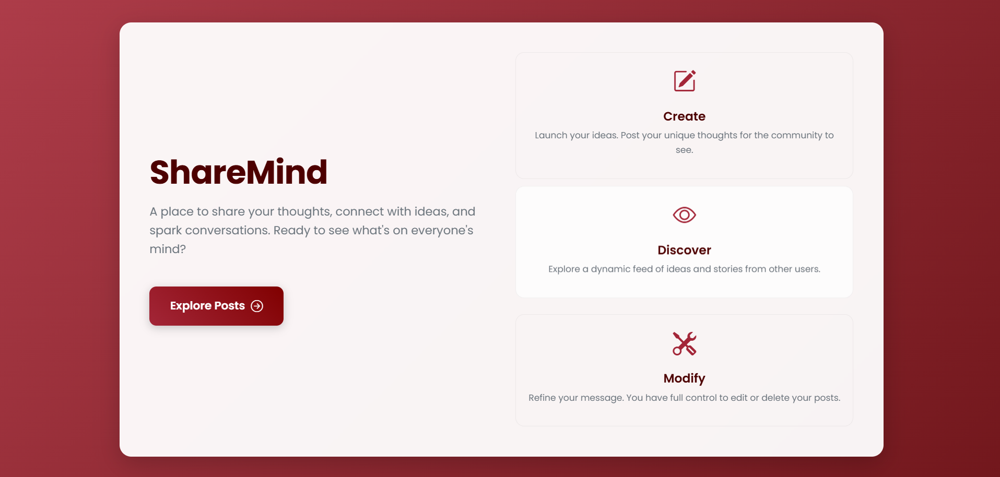
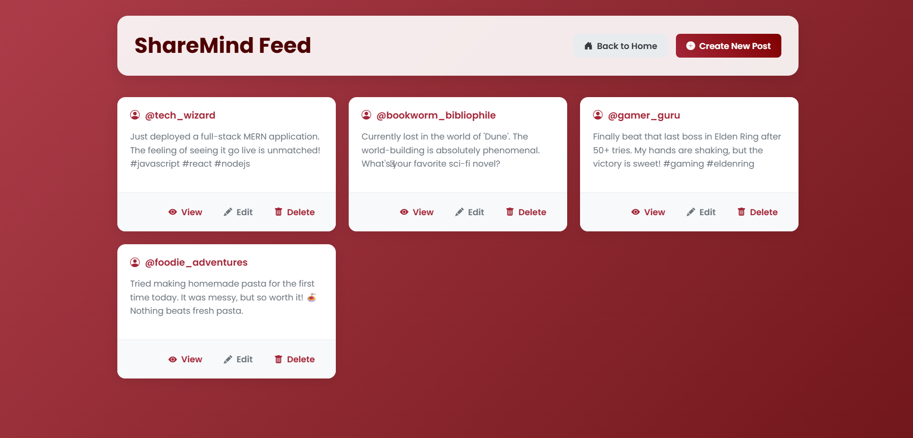
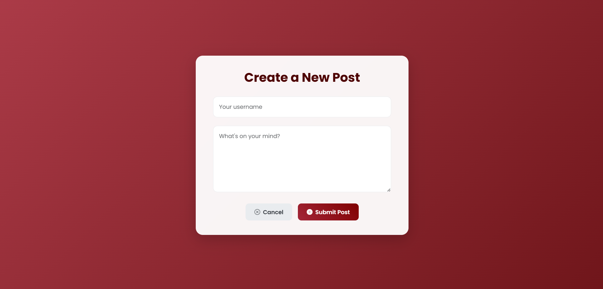

<h1 align="center">✒️ ShareMind - A CRUD Application</h1>

<p align="center">
  
  
  
  
</p>

---

## 🖥️ Project Overview

**ShareMind** is a stylish CRUD application for posting and managing content. Built with Node.js and Express, it showcases server-side rendering with a modern, fully responsive interface featuring animations and gradient effects.

---

## 🚀 Features

-   ✒️ **Create & Share:** An intuitive form to create new posts with a username and content.
-   👀 **Dynamic Feed:** A beautiful main page that displays all posts in a clean, card-based layout.
-   🔍 **Detailed View:** View each post individually on a dedicated page for a focused reading experience.
-   ✏️ **Edit with Ease:** A sleek editing interface to update the content of existing posts.
-   🗑️ **Delete Instantly:** Easily remove posts from the feed with a single click.
-   🎨 **Stunning UI/UX:** The entire application is designed with a modern aesthetic, featuring gradient backgrounds, hover effects, smooth transitions, and Bootstrap icons.
-   📱 **Fully Responsive:** Looks and works great on all devices, from mobile phones to desktops.

---

## 🛠️ Tools & Technologies Used

<p align="center">
  
  
  
  
  
  
  
</p>

---

## 📸 Screenshots

<div align="center">
  
  
  
</div>

---

## 🚀 Getting Started Locally
Follow these steps to run the project locally on your machine:

### 1️⃣ Clone the Repository
```bash
git clone [your-repository-url]
```
### 2️⃣ Navigate to the Project Folder
```bash
cd [project-folder-name]
```
### 3️⃣ Install Dependencies
```bash
Make sure you have Node.js installed. Then run:
npm install
```
### 4️⃣ Start the Development Server
```bash
node index.js
The application will be running on http://localhost:8080.
```

---

## 📌 Note
🧪 This project was built primarily for learning and practice purposes, focusing on backend fundamentals with Express.js and server-side rendering with EJS. It uses an in-memory array for data storage, which means all posts will be reset if the server restarts.

---

## 🌟 Future Enhancements (The Epic Quest Log)

This project is far from finished! Here's a look at the epic quests and legendary features we plan to add in the future:

## 🌟 Future Enhancements (The Epic Quest Log)

This project is far from finished! Here's a look at the epic quests we plan to add in the future:

-   🧠 **Persistent Data (Database):** Upgrade from the temporary in-memory array to a real database like **MongoDB** to ensure posts are saved permanently.

-   🔐 **User Accounts:** Implement a full authentication system (signup, login, password hashing) so users can securely own and manage their content.

-   🛡️ **Data Validation:** Add server-side checks to ensure all submitted content is clean, valid, and secure before being saved.

-   🤖 **Decoupled API:** Refactor the backend into a dedicated **REST API** to support modern frontends like React or mobile apps.

-   ❤️ **Social Interaction:** Introduce features for **liking** and **commenting** on posts to make the platform more engaging.

-   🖼️ **Image Uploads:** Allow users to upload images with their posts to add a visual element to their content.

---

## 🙌 Connect & Contribute
Feel free to explore the code, provide feedback, or reach out for collaboration!

<p align="center"> <a href="https://github.com/samjaiswal51" target="_blank">  </a> <a href="https://www.linkedin.com/in/samarth-jaiswal-72b67b313/" target="_blank">  </a> <a href="https://leetcode.com/samjaiswal51" target="_blank">  </a> <a href="https://www.hackerrank.com/samjaiswal51" target="_blank">  </a> </p>

---

⚠️ This project is a work in progress. Feel free to fork, suggest changes, or contribute! And don't forget to leave a star ⭐ if you like it!
